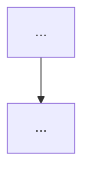

# /explain-simply

Explica código, um projeto inteiro, ou um fluxo específico em linguagem
simples — sem jargão corporativo — sempre com pelo menos um diagrama.

## Flow

### Step 1 — Entender o que precisa ser explicado

A partir de `$ARGUMENTS` ou do contexto da conversa, identifique:

- **Alvo:** um arquivo, uma pasta, o projeto inteiro, ou um fluxo/conceito
  específico (ex.: "como funciona o login").
- **Profundidade:** visão geral rápida ou explicação detalhada passo a passo.
- **Destino:** responder no chat (default) ou salvar em arquivo `.md`.

Se o alvo estiver ambíguo (ex.: pedido genérico "explica o projeto" num repo
grande sem indicar por onde começar), pergunte objetivamente antes de
prosseguir — não adivinhe o escopo.

### Step 2 — Mapear a estrutura (delegado)

Delegue o levantamento de fatos ao agent `codebase-mapper`, para manter o
contexto principal limpo e evitar leitura excessiva de arquivos nesta
conversa:

```
Agent(subagent_type: "codebase-mapper", prompt: "Mapeie [alvo] com foco em
[tópico, se houver]. Retorne pontos de entrada, peças principais, fluxo de
execução, dependências-chave e como as peças se conectam.")
```

Para alvos grandes com partes independentes (ex.: frontend + backend), pode
rodar múltiplas instâncias em paralelo, uma por parte.

### Step 3 — Escrever a explicação (você, com o contexto da conversa)

Use o mapa retornado pelo agent para escrever a explicação final. Regras
inegociáveis:

1. **Sem jargão corporativo.** Nada de "alavancar", "sinergia", "empoderar",
   "alinhar stakeholders", "leverage", "synergy". Use palavras do dia a dia.
2. **Objetivo.** Frases curtas. Vá direto ao ponto. Corte qualquer frase que
   não ajude a entender.
3. **Sempre com diagrama.** Inclua pelo menos um diagrama Mermaid, escolhendo o
   tipo pelo que está sendo explicado — não force tudo em formato de
   fluxograma:
   - **Processo/decisão sequencial** (ex.: passo a passo de uma validação) →
     `flowchart TD`.
   - **Interação entre peças ao longo do tempo** (ex.: chamadas entre
     serviços, requisição → resposta) → `sequenceDiagram`.
   - **Arquitetura/estrutura** (ex.: como módulos/camadas se conectam, sem
     ordem temporal) → `flowchart` em modo grafo (`graph TD` com setas de
     dependência, não de sequência).
   Não descreva em prosa algo que o diagrama mostra melhor.
4. **Sem inventar.** Baseie-se só no que o `codebase-mapper` retornou ou no que
   você leu diretamente. Se algo ficou pouco claro no mapa, diga isso em vez de
   arriscar.

Estrutura da resposta:

```markdown
## O que é / o que faz
[1-2 frases, visão geral]

## Como funciona
[passo a passo curto, na ordem real de execução]

## Diagrama


## Principais arquivos/pastas envolvidos
- `caminho` — [o que é]

## Pontos de atenção (se houver)
- [limitação, parte pouco clara, ou dívida técnica relevante]
```

Omita seções que não se aplicam (ex.: "Pontos de atenção" se não houver
nenhum) em vez de preenchê-las com texto de recheio.

### Step 4 — Entregar

Por padrão, responda no chat. Só crie um arquivo `.md` se o usuário pedir
explicitamente para salvar — nesse caso, pergunte onde (sugestão: `docs/`) e
confirme antes de escrever.

## Success Criteria

- [ ] Alvo e profundidade confirmados antes de explicar (perguntou se estava ambíguo).
- [ ] Exploração de código delegada ao `codebase-mapper`, não feita inline gastando contexto principal.
- [ ] Explicação final sem jargão corporativo e sem frases de recheio.
- [ ] Pelo menos um diagrama Mermaid presente, com o tipo certo para o que foi explicado (fluxo sequencial, interação entre peças, ou arquitetura).
- [ ] Nenhuma informação inventada — só o que foi mapeado ou lido de fato.
- [ ] Nenhum arquivo criado sem pedido e confirmação explícita do usuário.
